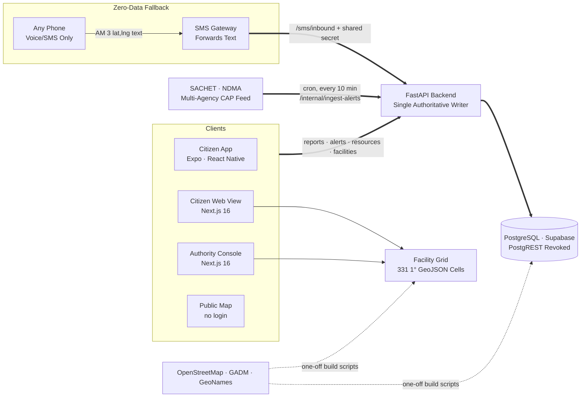
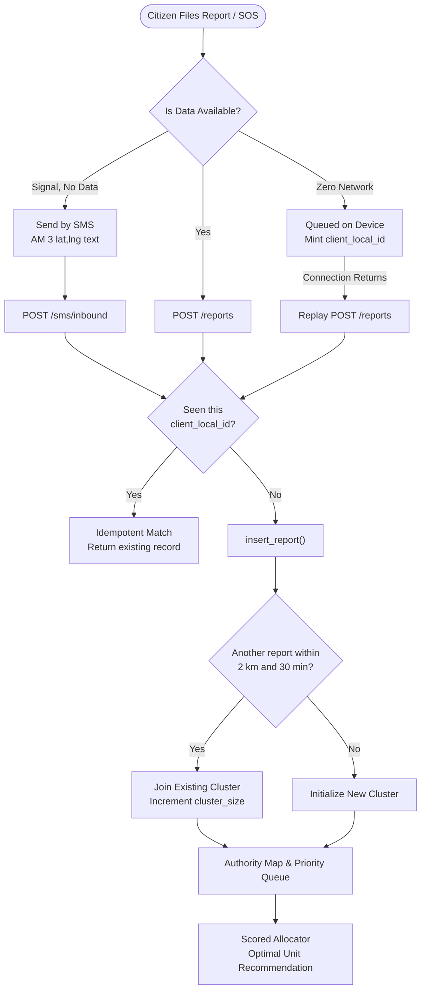

# AapdaMitra

### Real-Time Disaster Intelligence & Emergency Resource Coordination Platform
**Smart India Hackathon · Problem Statement PS-05 · Disaster Management**

[](https://aapda-mitra-sih.vercel.app/)
[](apps/backend)
[](apps/web)
[](apps/citizen-app)
[-4169E1.svg?logo=postgresql&logoColor=white)](supabase/migrations)
[](apps/backend/tests)
[](apps/citizen-app/src)
[](#multilingual-architecture)
[](LICENSE)

**[Open Live Demo →](https://aapda-mitra-sih.vercel.app/)** — zero signup friction; one-tap instant demo credentials for both Citizen and Authority consoles.

---

## The Problem

During major floods, cyclones, and landslides, rescue operations rarely fail from lack of willingness to help. They fail due to an acute **coordination gap** in the first critical hours:

- **Information Silos:** At 12:04, a citizen reports a collapsed bridge over WhatsApp to a local ward officer. An IMD Red Alert is active on SACHET. An NDRF rescue boat is idle 2 km away. None of the three systems can see the other two.
- **Zero-Connectivity Blackouts:** When cell towers lose grid power and mobile data collapses, standard smartphone reporting apps become completely useless.
- **Operator Overload & Duplicate Panics:** 50 separate callers reporting the same washed-out culvert flood dispatch desks as 50 independent emergencies, burying solitary life-or-death distress calls.
- **Language Barriers Across Scripts:** Official warnings published in regional languages are delayed or lost when citizen interfaces fail to render native scripts or distort official alerts through faulty machine translations.
- **Resource Allocation Blindspots:** Dispatching the "nearest" unit often sends an empty rescue boat to a fire or assigns an ambulance with zero remaining patient capacity.

**AapdaMitra eliminates this coordination gap by uniting official CAP feeds, geo-clustered citizen reports, and nearby resources onto a single unified tactical map with 1-click deterministic dispatch.**

---

## The Solution

A synchronized, multi-modal emergency platform designed for field resiliency:

1. **Citizen Safety Suite (`apps/citizen-app` & Web Citizen View):**
   - **1-Tap SOS Beacon:** Hold for 1.2s to file a critical emergency with zero typing required.
   - **Offline Queue + SMS Fallback:** Queues reports locally during complete network outages. Generates single-segment SMS (`AM <1-4> [lat,lng] [text]`) that routes over the voice network with automatic deduplication.
   - **14 Languages across 10 Scripts:** Native typography for Hindi, Bengali, Marathi, Telugu, Tamil, Gujarati, Urdu, Kannada, Odia, Malayalam, Punjabi, Assamese, Maithili, and English.
   - **GeoNames Town/City Fallback:** 7,120 searchable towns across all 594 districts ensure accurate manual reporting even when browser GPS is blocked.
   - **Nearby Critical Facility Radar:** On-demand spatial layer visualizing 58,232 verified hospitals, police stations, and fire stations from OpenStreetMap.

2. **Authority Command Cockpit (`apps/web`):**
   - **Multi-Agency CAP Ingestion:** Automated 10-minute polling of NDMA's SACHET feed (IMD weather warnings, Central Water Commission flood alerts, 15+ State SDMAs).
   - **Spatiotemporal Hotspot Clustering:** Automatically merges incident reports within **2 km and 30 minutes** into single actionable clusters.
   - **Explainable Scored Allocator:** Deterministic resource matching factoring real transit distance, vehicle capability fit (up to 20 km discount for specialized units), and spare capacity with double-dispatch locking.
   - **Tactical Geospatial Map:** Operations-instrument design (warm paper ground, Leaflet dark inverted basemap, non-blocking facility vector rendering, live incident density heatmaps).

---

## System Architecture



### Resilient Report Lifecycle & Deduplication



---

## What Makes AapdaMitra Different

### 1. Zero-Connectivity SMS Reporting with Idempotent Deduplication
When mobile data fails, a citizen can transmit an emergency report via standard SMS. The message is formatted as `AM <1-4> [lat,lng] [text]` (e.g., `AM 4 13.0827,80.2707 Flash flood trapped on roof`). The native app mints a unique `client_local_id`. If an SMS is sent and the app later reconnects and replays its offline queue, the backend collapses them into a single record rather than counting two separate emergencies.

### 2. Sliced 58,232 Facility Spatial Grid (Sub-Degree Indexing)
Rather than loading an unoptimized 2.9 MB GeoJSON blob that crashes mobile browsers, AapdaMitra partitions 58,232 OpenStreetMap hospitals, police stations, and fire stations across India into **331 one-degree spatial cells** (median 4 KB, max 79 KB). A viewport fetches only the 1 to 4 cells it intersects. On the mobile app, `GET /facilities` queries a PostgreSQL range-indexed bounding box with a 1-degree server safety cap.

### 3. Native Script i18n & Unaltered Official Alert Integrity
The citizen interface renders 14 languages across 10 distinct scripts (Devanagari, Bengali, Gurmukhi, Gujarati, Odia, Tamil, Telugu, Kannada, Malayalam, Perso-Arabic). While UI strings are localized, **official SACHET alert texts are never machine-translated**. Alerts are tagged with their native issuing language and sorted to prioritize the reader's tongue. This guarantees zero semantic distortion of government safety advisories.

### 4. Explainable, Mathematically Scored Resource Allocation
Instead of naive "nearest-neighbor" matching, dispatches are calculated deterministically:
$$\text{Score} = \text{Distance (km)} - \text{Capability Discount} - \text{Spare Capacity Bonus}$$
A critical rescue report awards a 20 km discount to an NDRF rescue team over a basic shelter. Dispatched units are locked to prevent concurrent double-booking and automatically returned to the available pool once an incident resolves.

### 5. Verified 7,120 Town GeoNames Fallback
Browser geolocation frequently fails on desktop PCs, unencrypted HTTP networks, or when permissions are dismissed. AapdaMitra embeds a curated dataset of **7,120 populated Indian towns and cities across all 594 districts** (matched via within-state polygon centroids). Hand-placed locations are stamped as `location_source: manual` to ensure dispatchers never mistake an approximation for a GPS fix.

---

## Feature Comparison

| Capability | AapdaMitra | Traditional Disaster Portals |
| :--- | :--- | :--- |
| **Official Alert Ingestion** | **Live SACHET (NDMA)** multi-agency CAP feeds | Manual operator entry / RSS scraping |
| **Offline Resilience** | **Local SQLite Queue + SMS fallback** | Requires active 4G/5G data |
| **Report Deduplication** | **Spatiotemporal 2km/30min clustering** + `client_local_id` | Duplicate tickets swamp dispatchers |
| **Resource Dispatch** | **Scored multi-factor allocator** with concurrency lock | Manual phone-tree coordination |
| **Static Infrastructure** | **58,232 real OSM facilities** (hospitals, police, fire) | Empty maps showing only registered fleet |
| **Multilingual Support** | **14 Indian Languages / 10 Scripts** + untampered alerts | English-only or broken auto-translate |
| **Location Resilience** | **GPS + 7,120 GeoNames town picker** | Hard failure if GPS permission denied |
| **Architecture Access** | **API-only writer**; PostgREST direct access revoked | Exposed database tables / client writes |

---

## Data Provenance & Architectural Honesty

| Component | Classification | Provenance & Implementation |
| :--- | :--- | :--- |
| **Official Emergency Warnings** | **LIVE** | Real-time 10-minute ingestion from NDMA SACHET CAP feeds (IMD, CWC, SDMAs). |
| **Citizen Reports & SOS** | **LIVE** | Full PostgreSQL persistence with clustering, photo URLs, and status tracking. |
| **Deterministic Allocator** | **LIVE** | Real-time mathematical scoring evaluating distance, suitability, and capacity. |
| **Critical Facilities Layer** | **LIVE / BUNDLED** | 58,232 verified Indian hospitals, police, and fire stations extracted from OpenStreetMap (ODbL). |
| **Town & District Geocoding** | **BUNDLED** | 7,120 Indian populated places from GeoNames (CC BY 4.0) & GADM 2.x administrative polygons. |
| **SMS Inbound Intake** | **LIVE** | `/sms/inbound` API live on Render with shared HMAC key authentication. *(Gateway forwarding hardware requires external SIM/carrier deployment).* |
| **IVR Telephony Channel** | **SIMULATED** | The console displays a simulated telephony feed (`SIMULATED — no live telephony`). |

---

## Tech Stack

| Layer | Technology | Version | Purpose & Rationale |
| :--- | :--- | :--- | :--- |
| **Backend API** | FastAPI (Python) | `0.141.1` | High-throughput asynchronous REST endpoints, Pydantic v2 validation. |
| **Database & Auth** | PostgreSQL (Supabase) | `15.x` | Relational persistence, PostgREST direct access revoked; bcrypt JWT auth. |
| **Web Frontend** | Next.js 16, React 19 | `16.3.3`, `19.0.0` | Turbopack SSR/SSG, operations-instrument design system, Tailwind CSS v4. |
| **Citizen Mobile App** | Expo / React Native | `SDK 57`, `0.81.5` | Cross-platform iOS/Android native bundle with offline SQLite/AsyncStorage queue. |
| **Mapping & GIS** | Leaflet, OpenStreetMap | `1.9.4` | Dark filtered basemaps, custom SVG marker overlays, spatial heatmaps. |
| **Typography & Fonts** | Google Fonts (10 Scripts) | Web / Native | Noto Sans & IBM Plex multi-script typography (Devanagari, Bengali, Tamil, etc.). |
| **Hosting & CI** | Vercel (Web), Render (API) | Cloud | Continuous deployment with automated build health checks. |

---

## Testing & Quality Verification

```bash
# 1. Run Backend Unit Tests (63 tests)
cd apps/backend
./.venv/Scripts/python -m pytest -v

# 2. Run Citizen App Unit Tests (51 tests)
cd apps/citizen-app
npx jest

# 3. Run Web TypeScript & Production Build Checks
cd apps/web
npx tsc --noEmit
npm run build
```

### Verified Benchmark Coverage:
- **Backend (63 Passing Tests):**
  - `test_allocator.py`: Multi-factor distance weighting, capacity exclusions, concurrency locks.
  - `test_facilities.py` & `test_facilities_route.py`: Bounding-box validation, 1-degree cap enforcement, kind parsing.
  - `test_sms.py` & `test_sms_inbound.py`: Grammar parsing, coordinate bounds, shared-secret security.
  - `test_sachet.py`: CAP XML ingestion, agency extraction, multi-language tagging.
  - `test_auth_core.py`: Password hashing, JWT claims verification.
- **Citizen App (51 Passing Tests):**
  - `facilities.test.ts`: Bounding box clamping, zoom thresholding, query parameter stability.
  - `sms-fallback.test.ts`: 160-char SMS encoding, URI generation for Android/iOS.
  - `alert-language.test.ts`: Multi-script alert sorting, language labelling without translation.
  - `theme.test.ts`: Exact cross-client color token parity against web CSS variables.
  - `api-client.test.ts`: Network timeouts, retry idempotency (POST vs GET).

---

## Local Development Setup

### 1. Backend Setup

```bash
cd apps/backend
python -m venv .venv
source .venv/bin/activate    # On Windows: .venv\Scripts\activate
pip install -r requirements.txt
cp .env.example .env        # Configure DATABASE_URL, JWT_SECRET, SMS_INBOUND_KEY
uvicorn app.main:app --reload --port 8000
```

### 2. Web Console Setup

```bash
cd apps/web
npm install
cp .env.local.example .env.local
npm run dev                 # Starts Next.js on http://localhost:3000
```

### 3. Citizen Mobile App Setup

```bash
cd apps/citizen-app
npm install
npx expo start              # Launch Metro bundler for iOS/Android/Expo Go
```

---

## Project Structure

```
AapdaMitra/
├── apps/
│   ├── backend/                 # FastAPI REST Engine & Ingestion Services
│   │   ├── app/
│   │   │   ├── routers/         # /alerts, /reports, /resources, /allocate, /facilities, /sms
│   │   │   ├── allocator.py     # Deterministic scored resource matching
│   │   │   ├── facilities.py    # Spatial bounding box validation
│   │   │   ├── sachet.py        # NDMA CAP XML alert parser & geocoder
│   │   │   ├── sms.py           # Single-segment SMS grammar parser
│   │   │   └── main.py          # ASGI application entrypoint
│   │   └── tests/               # 63 automated pytest suites
│   ├── web/                     # Next.js 16 Web Cockpit & Public Map
│   │   ├── src/
│   │   │   ├── app/             # App Router (/map, /, globals.css, icon.svg)
│   │   │   ├── components/      # Authority Console, Citizen Web View, Leaflet maps
│   │   │   └── lib/             # Facilities cell loader, theme tokens, i18n
│   │   └── public/facilities/   # 331 partitioned 1-degree spatial JSON cells
│   └── citizen-app/             # Expo / React Native Offline-Capable Mobile App
│       ├── src/
│       │   ├── app/             # Tabs: Index, Report, Alerts, Shelters, Mine, Help
│       │   ├── components/      # Native chips, BrandMark, LanguagePicker
│       │   └── lib/             # Offline queue, SMS fallback, script font loaders
│       └── assets/              # Native script typography & adaptive icons
└── supabase/
    ├── migrations/              # SQL DDL & PostgREST lockdown migrations (001 - 007)
    └── scripts/                 # Spatial cell slicer & facility database loader
```

---

## License

This project is licensed under the **[MIT License](LICENSE)**.
